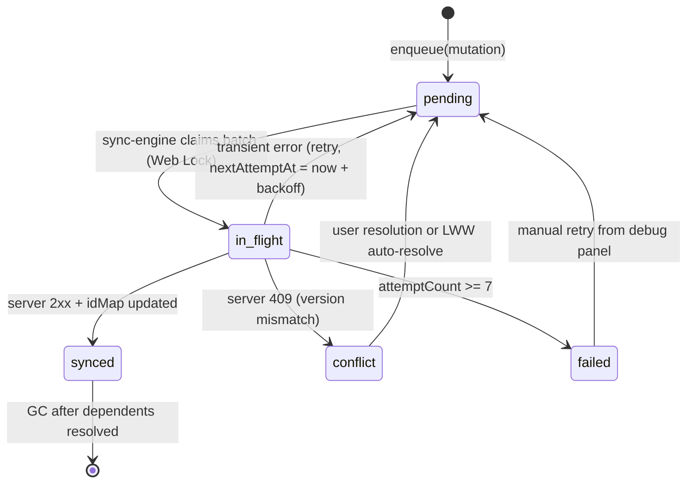
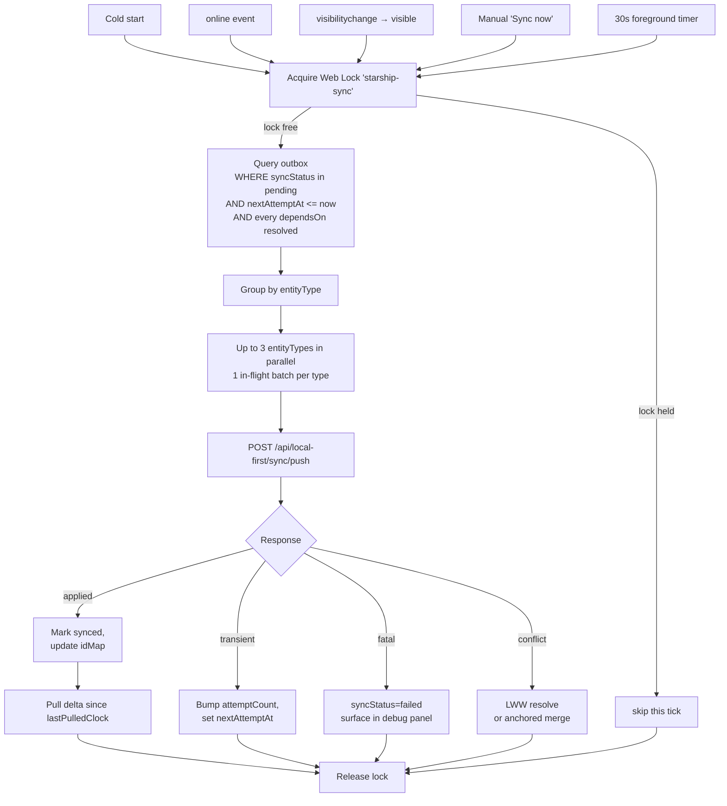

# Hossein Starship — Local-First Architecture

**Deliverable 2 of 2.**
**Date:** 2026-04-15
**Feature flag:** `STARSHIP_LOCAL_FIRST` — default `0`, flipped to `1` in Phase 6.

Consumes: [docs/local-first-audit.md](local-first-audit.md).

---

## 1. Storage Layout

We use three persistence tiers, picked by data shape.

### 1.1 Dexie (IndexedDB) — `starship-local-first` database

Ops metadata, local mirrors of server-owned state, and anything that must survive PGlite schema migrations untouched. Dexie is chosen because the app already depends on it (`dexie@^4.0.11`), its writes are independent of the PGlite WAL (so a PGlite corruption can't wipe the outbox), and it has native support for compound indexes we need.

Stores (all versioned under Dexie DB version `1`):

```
outbox
  keyPath: mutationId (UUID v4)
  indexes: [syncStatus, entityType, nextAttemptAt, localCreatedAt,
            '[entityType+entityLocalId]', '[syncStatus+nextAttemptAt]']

idMap
  keyPath: '[entityType+localId]'
  indexes: [entityType, serverId, '[entityType+serverId]']

tombstones
  keyPath: '[entityType+localId]'
  indexes: [entityType, deletedAt, serverConfirmedAt]

annotations
  keyPath: id (UUID v4 — the client localId)
  indexes: [docId, chapterNo, sourceBlockId, status,
            '[docId+sourceBlockId]', localUpdatedAt]

plannerTasks
  keyPath: id (server-generated when known, else localId)
  indexes: [planId, dayId, scheduledFor, status, localUpdatedAt]

plannerDays
  keyPath: id
  indexes: [planId, isoDate]

plannerPlans
  keyPath: id
  indexes: [status]

flashcardReviews
  keyPath: reviewLocalId (UUID v4 — the mutationId's twin)
  indexes: [flashcardId, reviewedAt, synced]

noteEdits
  keyPath: editLocalId (UUID v4)
  indexes: [noteId, appliedAt, synced]

importManifests
  keyPath: sha256
  indexes: [status, localCreatedAt, serverId]

dashboardSnapshot
  keyPath: name  # always 'latest'
  (single row with { capturedAt, stats: <ServerStats> })

meta
  keyPath: key
  (generic k/v: lastSyncAt, clientId, schemaVersion, persistRequested, …)
```

### 1.2 OPFS — `starship` root

File-like blobs. Raw import bytes (per the brief, `imports/{sha256}/raw.{ext}`) and any future asset archival.

```
/starship/
└── imports/
    └── {sha256-prefix-2}/{sha256}/
        ├── raw.bin          # original file bytes, chunked write
        └── meta.json        # { originalName, mime, sizeBytes, importedAt }
```

Chunked write strategy: files ≤ 8 MiB write in one go; larger files stream in 4 MiB windows to keep the worker responsive. Reads are full-file `file.arrayBuffer()` for now — chunked reads are not required because all downstream consumers (parser, uploader) already chunk on their own.

### 1.3 PGlite OPFS — untouched

The existing `@electric-sql/pglite` OPFS database (`opfs-ahp://uro-omega-v3`) keeps its entire schema. Local-first **never writes new tables to PGlite** in this refactor — all new state lives in Dexie. Rationale: PGlite migrations run as part of the existing import/sync path; adding local-first tables there risks stepping on the CRDT sync-client and the V3 importer, which the brief forbids touching.

PGlite is still the source of truth for synced content (`questions`, `flashcards`, `question_options`, `imports`, `notebooks`). The local-first layer reads from PGlite for those entities (via existing `useDb.ts` helpers) and writes through the outbox for new/updated records; the outbox handler writes back into PGlite as well as enqueueing the mutation for server push.

---

## 2. Outbox State Machine



Invariants:
- A mutation is never removed before it is `synced` (or explicitly discarded by user).
- `dependsOn: mutationId[]` — a child (e.g., a highlight created on a freshly-imported note) cannot transition out of `pending` until every entry in `dependsOn` is `synced`.
- `attemptCount` increments on every `in_flight → pending` transition.
- Backoff schedule: `1s → 2s → 4s → 8s → 16s → 30s` (cap). `nextAttemptAt = now + backoff[min(attemptCount, 5)]`.

Dexie type (implemented in `src/lib/local-first/idb.ts`):

```ts
interface OutboxRow {
  mutationId:     string;               // UUID v4, PK
  entityType:     EntityType;
  entityLocalId:  string;
  entityServerId: string | null;
  operation:      "create" | "update" | "delete";
  payload:        unknown;              // JSON
  baseVersion:    number | null;
  localCreatedAt: string;               // ISO
  localUpdatedAt: string;               // ISO
  syncStatus:     "pending" | "in_flight" | "synced" | "failed" | "conflict";
  attemptCount:   number;
  lastAttemptAt:  string | null;
  nextAttemptAt:  string | null;
  lastError:      string | null;
  dependsOn:      string[];              // mutationIds
}
```

Entity types: `note | highlight | annotation | flashcard_review | planner_item | import_manifest | imported_file | note_edit`.

---

## 3. Sync Engine Flow

All foreground. No Background Sync, no Periodic Sync, no Push.



- **One in-flight batch per `entityType`**: enforced by a Map-keyed advisory lock inside the engine.
- **Up to 3 entityTypes in parallel**: enforced by a counting semaphore.
- **Web Lock** `starship-sync` coordinates multiple tabs. Held exclusively per cycle, non-blocking (skip if unavailable).
- **Request shape** — always POST, always idempotent:
  ```
  POST /api/local-first/sync/push
  { batch: OutboxRow[] }     // at most 50 rows
  →
  { results: [ { mutationId, status: 'applied'|'conflict'|'transient'|'fatal',
                 serverId?: string, serverVersion?: number, error?: string } ] }
  ```

---

## 4. Anchoring Algorithm (highlights + annotations)

Stored fields per record:

```
sourceBlockId        stable block ID from the note schema (frameId)
textQuote            exact selected text
textPositionStart    offset within block text
textPositionEnd      offset within block text
prefix               up to 32 chars before selection
suffix               up to 32 chars after selection
blockChecksum        SHA-256 (hex, 16 char prefix) of block text at anchoring time
```

Re-anchor on render, in this order:

```text
function reanchor(ann, block):
  currentChecksum = hash16(block.text)
  if currentChecksum == ann.blockChecksum:
    return { ok: true, start: ann.textPositionStart, end: ann.textPositionEnd }

  # exact unique textQuote match
  matches = findAll(block.text, ann.textQuote)
  if matches.length == 1:
    return { ok: true, start: matches[0], end: matches[0] + ann.textQuote.length,
             updated: { textPositionStart, textPositionEnd, blockChecksum } }

  # prefix+quote+suffix fuzzy match (Levenshtein ≤ 10%)
  probe = ann.prefix + ann.textQuote + ann.suffix
  best  = fuzzyFind(block.text, probe, tolerance = 0.1)
  if best.unique:
    localized = locateQuoteWithin(best.range, ann.textQuote)
    return { ok: true, start: localized.start, end: localized.end,
             updated: { ..., blockChecksum: currentChecksum } }

  # give up — mark orphaned, surface in Needs Review
  markOrphaned(ann.id)
  return { ok: false, reason: 'orphaned' }
```

`Needs Review` is a Dexie query: `annotations.where('status').equals('orphaned')`.

---

## 5. Non-Destructive Migration Plan

The refactor adds new surfaces; it does not migrate existing data unless the feature flag is on.

Per-entity plan:

| Entity | Existing location | Migration on flag-on |
|---|---|---|
| Reader annotations | `localStorage[reader-annotations:*]` | On first boot with flag on, `migrateAnnotations()` copies every `reader-annotations:{docId}` row into the `annotations` Dexie store with `status = 'needs_reanchor'`. localStorage rows are **not deleted** until the user has opened and re-rendered the corresponding chapter (the keys are kept for rollback). A Phase-6 cleanup sweep removes them after 7 days of successful flag-on operation. |
| Sync checkpoints | `localStorage[uro_sync_last_*]` | Mirrored into Dexie `meta` store. The sync-client continues to read/write both until Phase 6 flips the fallback. |
| `uro_pglite_client_id` | localStorage | Kept in localStorage. Needed by `pglite-browser.ts` before Dexie is available. |
| Exam session id | `localStorage[exam_active_session]` | Out of scope for this refactor. Flagged in audit; fix deferred to a follow-up. |
| Flashcards | PGlite OPFS | Keep. Outbox only adds a review trail and a local FSRS mutation; the row itself stays in PGlite. |
| Planner | Server-only | Seeded from server on first successful fetch after flag-on, then mirrored into `plannerTasks/Days/Plans` Dexie stores. Writes become optimistic and enqueue outbox rows. |
| Dashboard snapshot | None | First successful `/api/dashboard/stats` response is captured to `dashboardSnapshot` Dexie row. Subsequent offline renders use it with an "offline snapshot" label. |
| Imports | V3 edge importer + PGlite | Unchanged. Offline import pipeline adds a parallel path that additionally archives raw bytes into OPFS and writes an `importManifest` Dexie row. |

Rollback: flipping the flag off makes the app fall back to the existing code path. Dexie data remains on disk but is unread. A debug panel button "Reset local-first state" clears Dexie + OPFS atomically.

---

## 6. Feature Flag Rollout

Flag value resolution order (first match wins):
1. `localStorage['starship-local-first-override']` — `'1'` or `'0'`. Allows per-device toggle for debug.
2. `process.env.NEXT_PUBLIC_STARSHIP_LOCAL_FIRST` — build-time default.
3. `'0'`.

Phased ramp:

| Phase | Default | Effect |
|---|---|---|
| 1–5 | `0` | New code ships but is dormant. Existing code paths untouched unless `isEnabled()` returns true. |
| 6 | `1` | Default ON. Rollback is a one-character env change. |

Every new module begins with `if (!isLocalFirstEnabled()) return legacyFn();` or an equivalent pass-through.

---

## 7. Test Plan — Failure Scenarios

Each scenario has an automated test or a written manual-test recipe. Tests live in `src/lib/local-first/__tests__/` (Node jsdom via the existing `jsdom` dev dep).

| # | Scenario | Test type | Location |
|---|---|---|---|
| 1 | Edit note offline → idle 3 days → edit again → reconnect. Both edits sync in order. | Automated | `outbox.ordering.test.ts` |
| 2 | Import offline → server returns 500 → eventually 200. Local refs update via idMap. | Automated | `sync.retry.test.ts` |
| 3 | Highlight offline → server content edit → reconnect → re-anchor. | Automated | `anchoring.reanchor.test.ts` |
| 4 | Delete note offline → server has newer version from another device. Delete wins, conflict logged. | Automated | `outbox.conflict.test.ts` |
| 5 | Import same 40 MB file twice → SHA-256 dedupe. | Automated | `import.dedupe.test.ts` |
| 6 | Storage quota hit during import → Persian error message, app stays usable. | Manual | scripted in README of module |
| 7 | iPad Safari evicts OPFS → recovery UI → re-fetch. | Manual + unit | `opfs.eviction.test.ts` |
| 8 | 500 flashcard reviews offline → all sync → server matches local. | Automated | `flashcard.bulk.test.ts` |
| 9 | SW update mid-session → outbox survives → mutations sync after update. | Manual | scripted + assertion |
| 10 | Two tabs open offline, both write → no collision, no double-process. Uses Web Locks. | Automated | `locks.multitab.test.ts` |

---

## 8. Module Layout

```
src/lib/local-first/
├── flag.ts                     # isLocalFirstEnabled()
├── uuid.ts                     # uuidV4()
├── locks.ts                    # withWebLock()
├── opfs.ts                     # OPFS helpers (put/get/delete, sha256)
├── idb.ts                      # Dexie schema + getLocalDb()
├── outbox.ts                   # enqueue/claim/mark/resolve
├── anchoring.ts                # hash16/anchor/reanchor
├── annotations.ts              # CRUD over Dexie annotations store
├── planner-local.ts            # CRUD + optimistic mutations
├── flashcard-review-local.ts   # FSRS-next + outbox enqueue
├── snapshot.ts                 # dashboard snapshot capture + load
├── sync-engine.ts              # triggers, loop, push/pull
├── import-offline.ts           # SHA-256 dedup + OPFS raw + manifest
├── storage-debug.ts            # quota/persisted/estimate helpers
└── __tests__/                  # (added as phases land)

src/components/local-first/
├── LocalFirstBoot.tsx          # client boot, mounts triggers + overlays
├── SwUpdatePrompt.tsx          # in-app "new version available" prompt
├── StorageWarningBanner.tsx    # "not persisted" non-blocking banner
├── DebugPanel.tsx              # quota/estimate/sync-state/Sync now
├── SyncNowButton.tsx           # reusable button → sync-engine.triggerNow()
└── NeedsReviewList.tsx         # orphaned anchors UI (Persian strings)

src/app/api/local-first/sync/
├── push/route.ts               # idempotent outbox apply endpoint
└── pull/route.ts               # delta pull endpoint
```

Existing files touched (minimal diff, behind `isLocalFirstEnabled()`):
- `src/hooks/useReaderAnnotations.ts` — routes through `annotations.ts` when flag on.
- `src/components/planner/PlannerClient.tsx` — seeds + reads from `planner-local.ts`.
- `src/components/planner/TodayTaskList.tsx`, `WeeklyView.tsx` — read from local when flag on.
- `src/components/planner/TaskCard.tsx` — mutations route through `planner-local.ts`.
- `src/components/flashcard/FlashcardReviewScreen.tsx` — review submission routes through `flashcard-review-local.ts`.
- `src/lib/dashboard/useDashboardData.ts` — snapshot read on mount + capture on success.
- `src/sw.ts` — remove unconditional `skipWaiting`/`clientsClaim`; add `SKIP_WAITING` message handler.
- `src/app/layout.tsx` — mount `<LocalFirstBoot />`.

---

## 9. What we explicitly will NOT build in this refactor

- CRDT merge for notes — LWW with tombstones.
- New Persian copy — everything new that surfaces to the user is either in existing Persian or is a reasonable translation where none exists.
- Exam-session offline mode — the audit flagged it; scope is too large for this phase and it's a standalone system.
- OPFS eviction auto-recovery beyond "show warning, let user re-sync".
- Planner aggregation on the client — aggregates come from server enrichment after each sync. Local mutations update a cached snapshot synchronously but the authoritative re-compute happens server-side.

---

**Deliverable 2 complete. Proceeding to Phase 1.**
